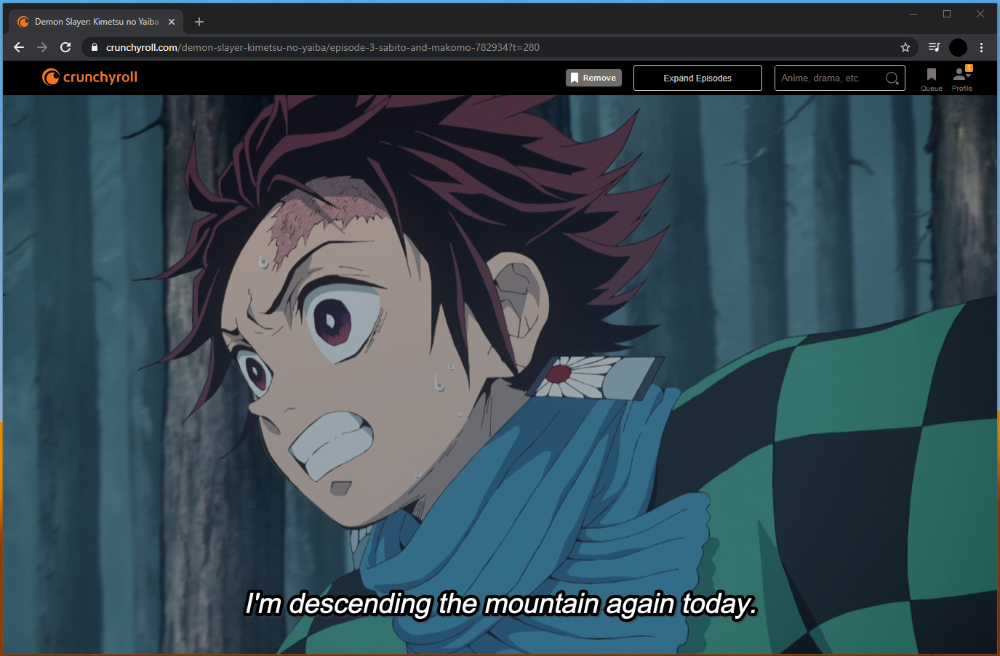

## BetterCrunchyRoll - Makes Crunchyroll better!

### Responsive video with inline episode selection and search

### How do I use these?
1. Download [Tampermonkey](https://chrome.google.com/webstore/detail/tampermonkey/dhdgffkkebhmkfjojejmpbldmpobfkfo?hl=en) Chrome extension
2. Go to Chromes extensions page (chrome://extensions), enable the Allow access to file URLs checkbox at the Tampermonkey item
3. Click the userscript you wish to use in the repo
4. Click 'raw', when redirected to Tampermonkey click 'install'

  --- OR ---
  
4. In the Tampermonkey dashboard under "Utilites" paste the raw URL into the "Install from URL" field and submit
